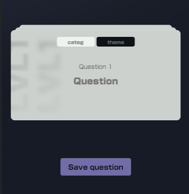
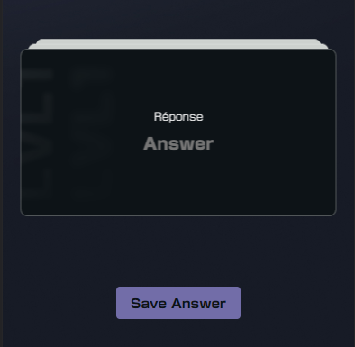

# _**UNENDLY**_

_Developped by Mohamed Ndoye_

Le projet unendly est un jeu de mémoire qui nous permet de retenir des notions à l'aide du principe de répétition
espacée.

Pour le mettre en place, j'ai mis en place un cycle de révision afin de pouvoir gérer les évènements par étapes.

Avant de pouvoir commencer la révision des cartes, nous devons d'abord en créer quelques-unes

## Card component

Avant de passe à la création des cartes, regardons de quoi elles sont composées.
Sautons les champs question, réponse, catégorie, id, level et thème qui sont assez explicite

J'ai ajouté un paramètre revealed qui va permettre d'ajouter ou enlever une classe à la carte pour lancer une animation
permettant de passer de la face de la question à celle de la réponse

```javascript
:

class

= "{ revealed: revealed }"
```


Le paramètre supplémentaire qui sera utile est le paramètre 'dateOfStudy'.
Il va être particulièrement utile pour récupérer uniquement les cartes à réviser le jour correspondant.

## Création des cartes

Pour cela, nous arrivons sur la page "daily-new-cards" qui va afficher un stack de carte que nous modifions une par une
afin de les ajouter à la liste de carte globale.

La liste est générée grâce à une variable 'cardsPerDay' du store 'settings' qui correspond au nombre de cartes à ajouter
par jour




L'interface est assez simple, nous cliquons sur chaque input que nous souhaitons modifier (dans un premier temps
question, categorie et theme) et ensuite, nous cliquons sur le bouton 'save question'.
Lors de la modification des valeurs, une variable reactive va se mettre à jour afin de garder les paramètres de la
question

Le premier clique sur le bouton va simplement retourner la carte pour nous permettre d'éditer la réponse à mémoriser.

Une fois fait, on clique sur le bouton 'Save answer'

Lors de ce click, nous allons ajouter la carte dans un tableau intermediate qui servira à ajouter toutes les nouvelles
cartes dans la liste des cartes existantes.

### Démarrage de la session study

Une fois toutes les nouvelles cartes ajoutées, nous avons l'écran suivant


La session study fût assez complexe à mettre en place.

Pour me simplifier la tâche au niveau de l'algorithme, j'ai ajouté un paramètre 'dateToStudy' aux cartes.
Celui-ci va me permettre d'abord de récupérer les cartes à étudier le jour de la session, et également gérer
l'espacement de la révision selon le niveau de la carte.

L'espacement peut être résumé à la formule 2^(niveau - 1). Nous doublons le nombre de jours d'attente avant la prochaine
révision.
Quand on clique sur le bouton "je m'en souvenais" le code suivant s'exécute

```javascript
// Je récupère la carte à mettre à jour
let cardToChange = allCards.value.find(card => card.id == cards.value.at(-1)?.id)
as
Card;

// Je change son niveau, si réussi on augmente de 1 sinon on remet la carte au niveau 1
cardToChange.level = remembered ? cardToChange?.level + 1 : 1;
// On passe la carte en 'étudiée'
cardToChange.studied = true;
// On met à jour la date de révision en fonction du nouveau niveau de la carte
cardToChange.dateOfStudy = moment().add(2 ** (cardToChange.level - 1), 'days').format('DD/MM/YYYY')

// On regarde si il n'y a plus de cartes pour le niveau actuelle et si nous ne venons pas de finir le dernier niveau à reviser de la journée 
if (cards.value.length == 0 && levelToStudyIndex.value < levelsOfTheDay.length - 1) {
    // Si oui on lance la transition pour passer au niveau suivant, puis on récupère les cartes correspondantes
    transitionAnimation();
    levelToStudyIndex.value++;
    cards.value = studyStore.getStudyCards(levelsOfTheDay[levelToStudyIndex.value]);
} else if (cards.value.length == 0 && levelToStudyIndex.value >= levelsOfTheDay.length - 1) {
    // Sinon on annonce que nous avons complété la session de révision du jour
    dailyStudiesComplete.value = true;

    // On met à jour la dernière date de révision
    lastStudiedDate.value = moment().format('DD/MM/YYYY')

    // On reset l'état des cartes (passe l'état revealed et studied à false)
    studyStore.resetStudyCardsState();
}
```

Une fois les sessions terminée nour retournons à la page d'accueil


## Page Settings

La page settings ne va servir qu'à changer deux paramètres. Le nombre de cartes à ajouter par jour, ainsi que l'heure de
révision


Avec un contôle pour ne pas trop surcharger notre cerveau et aussi mettre une heure de la journée qui existe


## Deploiement

Pour le déploiement de l'application, j'ai opté pour vercel. C'est un service gratuit qui se lie au repository git du
projet et se deploie lors des push sur la branche master. En ayant eu des problèmes perpetuel de connexion, je n'ai pas
pu tirer profit plus tôt du service malheureusement

## Améliorations (à venir)

Bien que ces améliorations ne pourrons pas être notées, je compte peaufiner le projet pour avoir quelque chose de bien
plus qualitatif.

- [ ] Malgré réussi à implémenter la possibilité de faire fonctionner l'application en hors ligne à l'aide du module
  vitepwa, je n'ai pas trouvé de moyen d'envoyer la notification de rappel de révision de façon récurrente et
  fonctionnelle même hors ligne
- [ ] Le projet necessite quelque retouche en termes d'animation et d'homogènéité
- [ ] L'ajout des audio, photos et vidéos
- [ ] Réfactoring du code pour l'optimiser au mieux